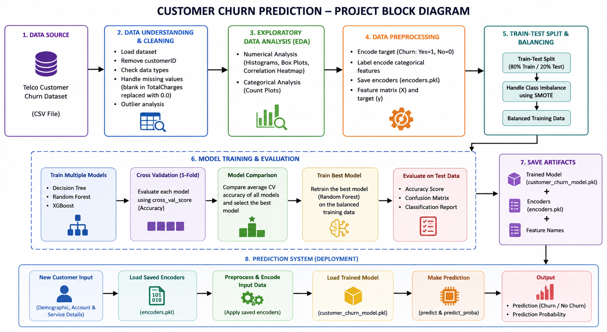
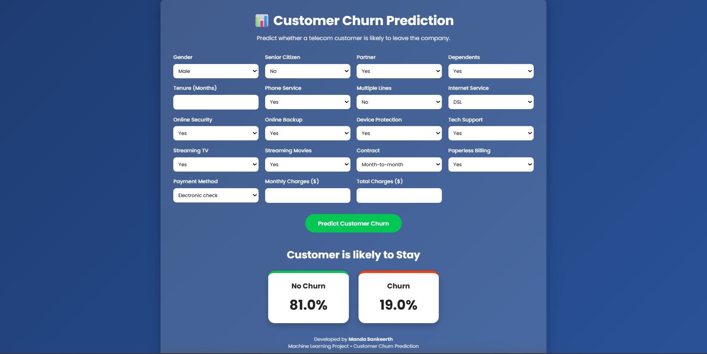
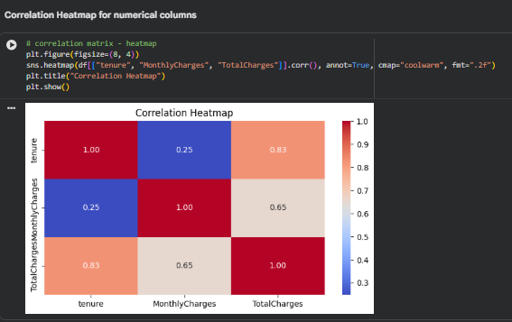
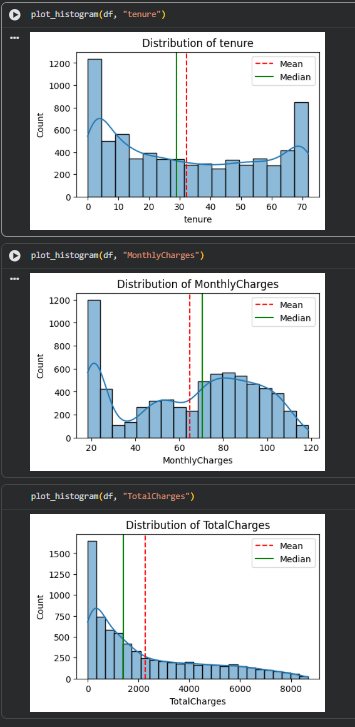
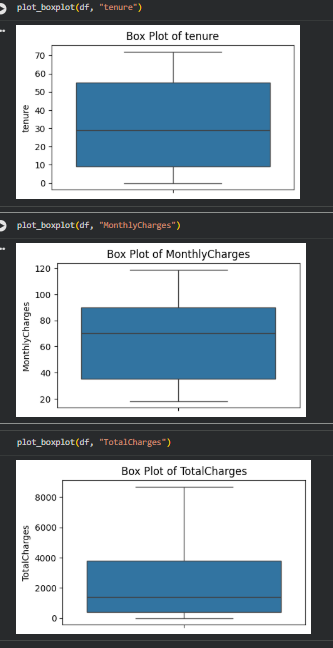

<div align="center">

# 🚀 Customer Churn Prediction using Machine Learning

### Predict customer churn before it happens using Machine Learning and a Flask Web Application


---

### ⭐ Predict whether a telecom customer is likely to churn using Machine Learning.

</div>

---

# 📖 Project Overview

Customer churn is one of the biggest challenges faced by telecom and subscription-based companies. Losing an existing customer costs significantly more than retaining one.

This project develops an intelligent **Machine Learning model** capable of predicting whether a customer will **Stay** or **Churn** based on customer demographics, subscribed services, billing information, and account history.

The trained model is deployed as an interactive **Flask Web Application**, allowing users to enter customer details and receive instant churn predictions.

---

# 🎯 Problem Statement

Businesses lose millions of dollars every year due to customer churn.

The objective of this project is to identify customers who are likely to leave the company so that businesses can proactively improve customer retention through personalized offers, customer support, and loyalty programs.

---

# ✨ Features

✅ Complete Data Preprocessing

✅ Exploratory Data Analysis (EDA)

✅ Feature Engineering

✅ Machine Learning Classification

✅ Model Evaluation

✅ Pickle Model Serialization

✅ Flask Web Application

✅ Interactive User Interface

✅ Real-Time Prediction

---

# 🏗️ Project Architecture

> Replace this image with your Block Diagram.

<p align="center">

</p>

---

# 🌐 Web Application


## 📈 Prediction Result

<p align="center">

</p>

---

# 📊 Dataset Features

The model predicts customer churn using the following features:

- Gender
- Senior Citizen
- Partner
- Dependents
- Tenure
- Phone Service
- Multiple Lines
- Internet Service
- Online Security
- Online Backup
- Device Protection
- Tech Support
- Streaming TV
- Streaming Movies
- Contract Type
- Paperless Billing
- Payment Method
- Monthly Charges
- Total Charges

---

# ⚙️ Technology Stack

| Category | Technologies |
|----------|--------------|
| Programming Language | Python |
| Data Analysis | Pandas, NumPy |
| Visualization | Matplotlib, Seaborn |
| Machine Learning | Scikit-Learn |
| Backend | Flask |
| Frontend | HTML, CSS |
| Version Control | Git & GitHub |

---

# 🔄 Machine Learning Workflow

```
Customer Dataset
        │
        ▼
Data Cleaning
        │
        ▼
Exploratory Data Analysis
        │
        ▼
Feature Engineering
        │
        ▼
Data Encoding
        │
        ▼
Train-Test Split
        │
        ▼
Model Training
        │
        ▼
Model Evaluation
        │
        ▼
Save Model (.pkl)
        │
        ▼
Flask Application
        │
        ▼
Customer Churn Prediction
```

---

# 📈 Exploratory Data Analysis

## Heat Map

<p align="center">

</p>

---

## Histogram Plots

<p align="center">

</p>

---

## Box Plots

<p align="center">

</p>

---

# 📊 Model Performance

The trained model was evaluated using:

- ✅ Accuracy Score
- ✅ Precision
- ✅ Recall
- ✅ F1 Score
- ✅ Confusion Matrix
- ✅ ROC-AUC Score

---

# 💻 Project Structure

```
Customer-Churn-Prediction
│
├── app.py
├── customer_churn_model.pkl
├── Customer_Churn_Prediction.ipynb
├── Requirements.txt
├── README.md
│
├── templates
│      └── index.html
│
├── static
│      └── style.css
│
├── images
│      ├── block_diagram.png
│      ├── home_page.png
│      ├── prediction_result.png
│
├── CCP_HeatMap.png
├── CCP_Box_Plots.png
├── CCP_Histogram_Plots.png
```

---

# 🚀 Installation

```bash
git clone https://github.com/SANKEERTH2006-TECH/Customer-Churn-Prediction.git

cd Customer-Churn-Prediction

pip install -r Requirements.txt

python app.py
```

---

# 🎯 Prediction Output

🟢 **No Churn**

The customer is likely to continue using the service.

🔴 **Churn**

The customer is likely to leave the company.

---

# 📌 Future Improvements

- Docker Deployment
- REST API
- SHAP Explainable AI
- Power BI Dashboard
- Batch CSV Prediction
- Cloud Deployment
- Automated Model Retraining

---

# 👨‍💻 Author

## Manda Sankeerth

🎓 B.Tech - Electronics and Communication Engineering

💻 Aspiring Data Scientist | Machine Learning Enthusiast

⭐ If you found this project useful, don't forget to **Star** this repository.

---

<div align="center">

## ⭐ Thank You for Visiting ⭐

Made with ❤️ using Python, Machine Learning and Flask

</div>
